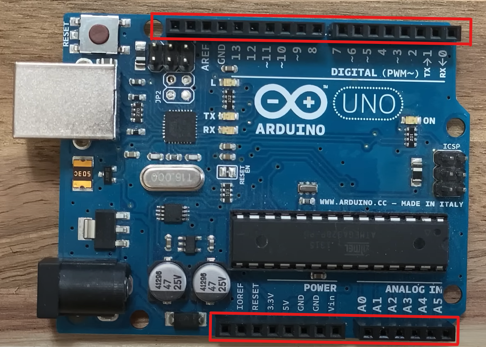
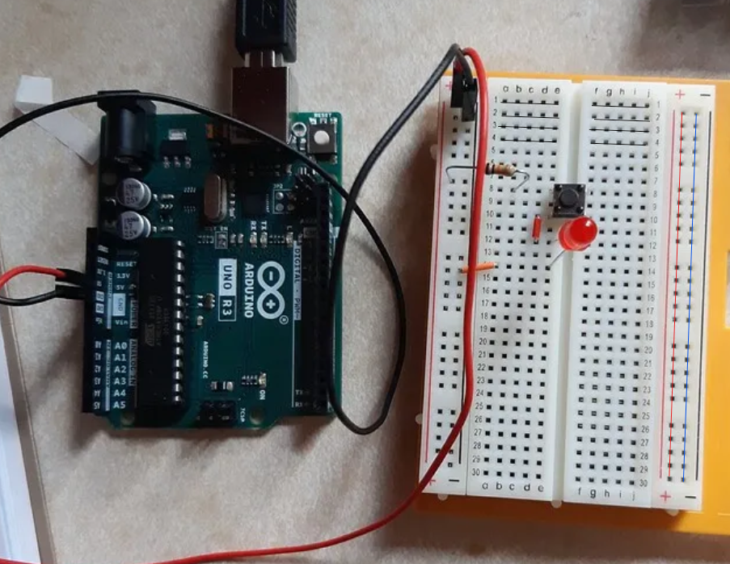
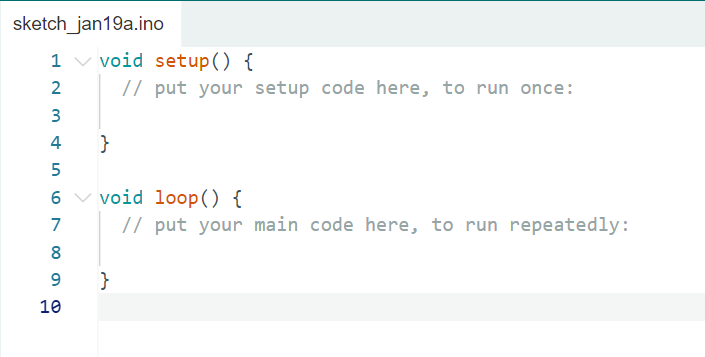

# Introduction to Learning Arduino

Arduino is a powerful tool that bridges the gap between the digital and physical worlds. Whether you want to build a simple electronic gadget or dive into more advanced projects, Arduino provides a versatile platform for controlling electronic components. This guide aims to provide a foundational understanding of what Arduino is, what it can do, and how to get started with it.

### What Is Arduino?

At its core, Arduino is a platform for building electronic projects. It includes both hardware and software components, making it an all-in-one solution for beginners and experienced makers alike. The hardware is typically an Arduino board, which features a microcontroller—essentially a small computer capable of processing data and executing commands. The software, called the Arduino Integrated Development Environment (IDE), allows users to write, edit, and upload code to the board.

### Understanding Inputs and Outputs

Arduino works as a mediator between input and output devices, enabling you to control the behavior of electronic components through programming.

- **Inputs**: These are devices that gather information from the environment. Examples include sensors that measure temperature, detect light, or sense motion.
- **Outputs**: These are devices that perform actions based on the input data. Examples include LEDs, motors, and speakers.

By connecting inputs and outputs to an Arduino board, you can create interactive projects—such as a smart home system or a robot—and control them using custom logic.

### How Arduino Works

The key role of Arduino is to process input data and execute output actions based on the logic you define in the code. Here’s how the process unfolds:

1. **Hardware**: Select an Arduino board suitable for your project’s requirements. All Arduino boards share the common feature of a microcontroller but may differ in specifications like size, power, and input/output pins.
2. **IDE**: Use the Arduino IDE to write your code. This software simplifies coding and debugging, providing essential tools to upload the program to your board. IDE stands for Integrated Development Environment.
3. **Code (Sketch)**: The code you write is referred to as a sketch. Arduino sketches are based on C and C++ programming languages but include specialized functions for Arduino, making them beginner-friendly. Learning Arduino coding can also pave the way for mastering other programming languages.

### Why Learn Arduino?

Learning Arduino is not only an introduction to electronics but also a gateway to the broader world of programming, robotics, and IoT (Internet of Things). It is beginner-friendly and widely supported by an active community, ensuring a wealth of resources, tutorials, and project ideas.

### Getting Started

To begin your journey with Arduino, you need three main components:

1. **Arduino Hardware**: Choose an Arduino board, such as the Arduino Uno, which is ideal for beginners.
2. **Arduino IDE**: Download and install the free Arduino IDE from the official Arduino website.
3. **Code and Components**: Start with simple projects using basic components like LEDs and buttons before advancing to more complex setups with sensors and motors.

# What’s on an Arduino Board

In this chapter, we will dissect the parts of an Arduino board and explain their features and functions. This overview will try to provide a clear understanding of the elements that make up this tool.

## Understanding the Arduino Board

At its core, the most important component is the one highlighted in the Figure below. **The Microcontroller** — the brain of the board — which processes your code and enables communication with the outside world through its pins. These pins can be configured as **inputs** (for reading sensor values) or **outputs** (for controlling devices). Collectively, these pins are referred to as **GPIOs** (General Purpose Input/Output).

**Input Pins** read voltage levels applied to the pins and **Output Pins** adjust the voltage at the pins to control external devices.

GPIO are basically the bridge between your code and the physical components you wish to work with.

## Exploring Pin Headers

The plastic columns filled with holes that you see highlighted on the Arduino board below are called **pin headers**. These headers connect the GPIOs to external components such as wires, resistors, or sensors. Each hole in the pin header corresponds to a microcontroller pin, facilitating electrical connections.

### Digital Pins (1-13)

On one side of the board, you will find **digital pins**, labeled 1 through 13. These pins primarily handle binary input/output (on/off signals), High (5V): Represents an ON state while Low (0V): Represents an OFF state.

Digital pins allow you to control LEDs, buzzers, and other devices. Additionally, they support communication protocols for interacting with more complex peripherals.

Some of these pins have special features, for example **Pins 0 and 1 (TX and RX)** are used for communication via USB. These pins transmit (TX) and receive (RX) data, with corresponding LEDs flash during activity.

**PWM Pins** which are marked with a tilde (~) support **Pulse Width Modulation (PWM)**, which is 
a way to control the amount of power delivered to a device by quickly turning a signal on and off. The "on" time is called the **duty cycle**, and it's expressed as a percentage, **100% duty cycle**: Fully ON (max power), **50% duty cycle**: Half ON, half OFF (half power) and **0% duty cycle**: Fully OFF (no power).
This allows you to do a lot of features such as fading LEDs in and out, controlling motor speeds and driving servo motors by varying voltage levels over time.

### Analog Pins (A0-A5)

On the opposite side of the board, you will find the **analog input pins**, labeled A0 to A5. These pins are connected to the microcontroller’s **Analog-to-Digital Converter (ADC)**, enabling them to read continuous signals and convert them into digital values, they are able to Read data from sensors with variable outputs. For example a temperature sensor’s output voltage varies with temperature changes. By connecting it to an analog pin, the Arduino reads the voltage and converts it into a temperature value via code.

### Power Pins

Next to the analog section are the **power pins**, which provide voltage sources for external components, the **GND** pin which stands for Ground references the lowest voltage on the board. While **5V and 3.3V** pins can be used to supply power to components connected to the board requiring these voltage levels. The **VIN** pin is used to supply external power to the Arduino when not connected via USB, it accepts a voltage input within a specific range (e.g., 7-12V).

### Additional Pins and Features

- **IOREF**: This pin tells shields (add-on boards) what voltage the Arduino is using (5V or 3.3V). It helps shields adjust to work properly without damaging the board.
- **RESET**: This pin lets you restart your Arduino. It’s like rebooting a computer to run your code again from the beginning.
- **AREF (Analog Reference)**: This pin is used when you need your analog sensors to measure with more precision. You can connect a specific reference voltage here to improve accuracy.

### Powering the Arduino

You can power the Arduino board in three main ways: through the **USB port**, which also allows you to program it, via the **DC barrel jack**, which accepts external power sources like batteries or adapters, or using the **VIN pin**, where you can connect a direct voltage source, ensuring it falls within the safe operating range to prevent damage.

## Breadboards

When working with an Arduino, a breadboard is a valuable tool that allows you to easily prototype your circuit without the need for a mess. By using jumper wires, you can create temporary connections between components, making it easier to experiment with different setups. This not only keeps your project neat and organized but also allows for quick adjustments and testing, making it an essential part of any Arduino project.

The Breadboard has a grid of holes where you can insert components like resistors, LEDs, and wires. Inside the breadboard, there are metal clips underneath that connect certain rows of holes. These clips create paths for electricity to flow, allowing you to make connections between different components easily.

The breadboard has two main sections:

1. **Power Rails**: These are the long horizontal rows on the sides, usually marked with "+" and "-" signs. They provide power (positive and negative) to your circuit.
2. **Terminal Strips**: These are the smaller groups of holes in the middle, where most components are placed. The rows in the middle are connected in pairs, so when you place a component's leads into the same row, they are electrically connected.

I have showed in the Figure below how some of these holes are connected

# How to Program an Arduino Board

In the third and last chapter of this introductory paper about Arduino, we will be learning the basics of programming an Arduino board. We will cover how every Arduino program is laid out, how to use variables, how to use control structures and the most important Arduino functions. 

## How to Use Variables (Setup & Loop)

### *The Setup and Loop functions*

When you first open a new sketch in your Arduino IDE, you will find some lines written just like in the below figure:

These lines are the two main functions of any Arduino code, the first function is called “Setup”, this is where you put the part of the code that needs too run once, and any code you put here will be executed to to bottom until it reaches the end of the function and moves on to the next function.

The Loop function also executes the code within it from top to bottom, and once it gets to the curly bracket signaling the end of the function it goes back to the beginning and runs the code once again. The code in this function keeps repeating itself until you remove the power from you Arduino board.

These two function “Setup” and “Loop” are extremely important, and will be part of any Arduino code you will write, in fact if you leave one of these codes out you’re going to get an error.

### *Variables*

Variables are also an essential part of programming an Arduino board that you will be using in every Arduino program. If you have any experience with programming you’re most likely familiar with the concept of variables, but we will have a brief reminder just in case you’re not.

type name = value; //Declaration and initialization

A Variable is like a box where you can store information, if you’re trying to store the value from a sensor for example you would put into a variable.

A Variable needs four things, a ***type, name, equal sign and a value*** that you can actually store into the variable.

The type represents the data type, whether it’s a number, character, integer etc. It’s basically the kind of information you will be storing. There’s a bunch of data types below is some of these types.

The name of the variable is how you would like to refer to it in your code, variable names can contain letters, numbers and underscores but they can’t start with a number.

The equal sign is the assignment operator it basically means you take the value you have and store into your variable.

Note: When you declare a variable, you can use it in your code just by the name.

type name;
name = value;