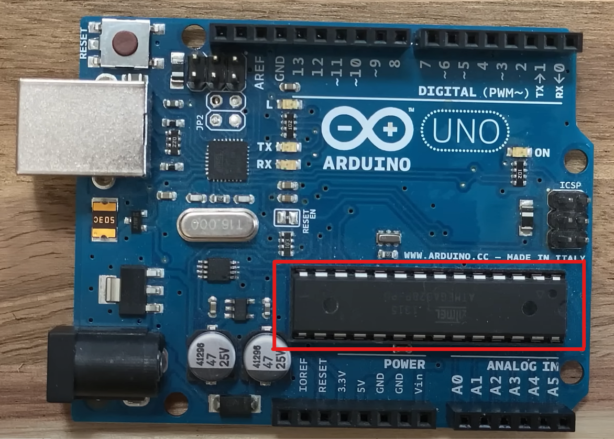

# Introduction to Learning Arduino

Arduino is a powerful tool that bridges the gap between the digital and physical worlds. Whether you want to build a simple electronic gadget or dive into more advanced projects, Arduino provides a versatile platform for controlling electronic components. This guide aims to provide a foundational understanding of what Arduino is, what it can do, and how to get started with it.

### What Is Arduino?

At its core, Arduino is a platform for building electronic projects. It includes both hardware and software components, making it an all-in-one solution for beginners and experienced makers alike. The hardware is typically an Arduino board, which features a microcontroller—essentially a small computer capable of processing data and executing commands. The software, called the Arduino Integrated Development Environment (IDE), allows users to write, edit, and upload code to the board.

### Understanding Inputs and Outputs

Arduino works as a mediator between input and output devices, enabling you to control the behavior of electronic components through programming.

- **Inputs**: These are devices that gather information from the environment. Examples include sensors that measure temperature, detect light, or sense motion.
- **Outputs**: These are devices that perform actions based on the input data. Examples include LEDs, motors, and speakers.

By connecting inputs and outputs to an Arduino board, you can create interactive projects—such as a smart home system or a robot—and control them using custom logic.

### How Arduino Works

The key role of Arduino is to process input data and execute output actions based on the logic you define in the code. Here’s how the process unfolds:

1. **Hardware**: Select an Arduino board suitable for your project’s requirements. All Arduino boards share the common feature of a microcontroller but may differ in specifications like size, power, and input/output pins.
2. **IDE**: Use the Arduino IDE to write your code. This software simplifies coding and debugging, providing essential tools to upload the program to your board. IDE stands for Integrated Development Environment.
3. **Code (Sketch)**: The code you write is referred to as a sketch. Arduino sketches are based on C and C++ programming languages but include specialized functions for Arduino, making them beginner-friendly. Learning Arduino coding can also pave the way for mastering other programming languages.

### Why Learn Arduino?

Learning Arduino is not only an introduction to electronics but also a gateway to the broader world of programming, robotics, and IoT (Internet of Things). It is beginner-friendly and widely supported by an active community, ensuring a wealth of resources, tutorials, and project ideas.

### Getting Started

To begin your journey with Arduino, you need three main components:

1. **Arduino Hardware**: Choose an Arduino board, such as the Arduino Uno, which is ideal for beginners.
2. **Arduino IDE**: Download and install the free Arduino IDE from the official Arduino website.
3. **Code and Components**: Start with simple projects using basic components like LEDs and buttons before advancing to more complex setups with sensors and motors.

