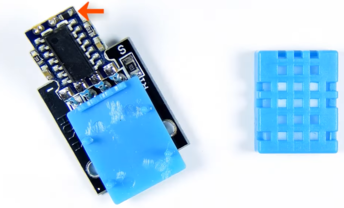
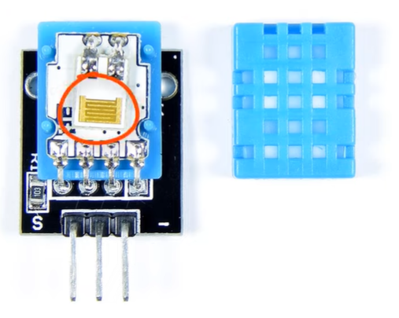
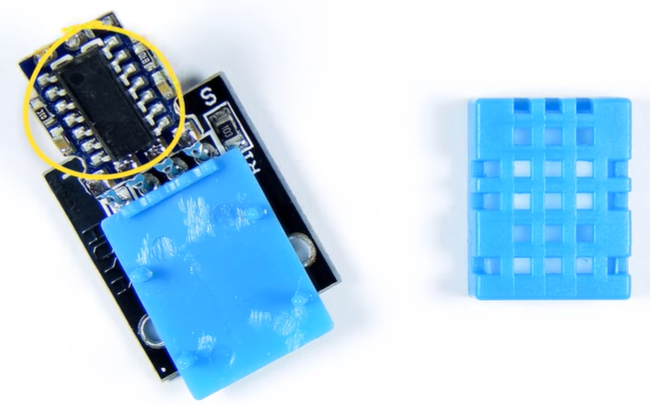
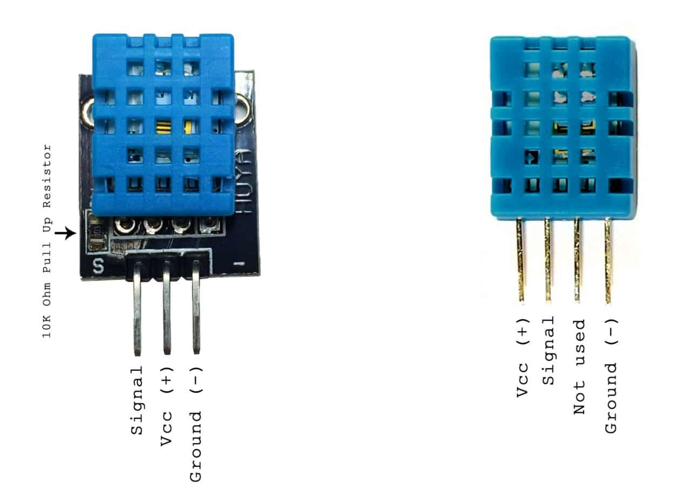
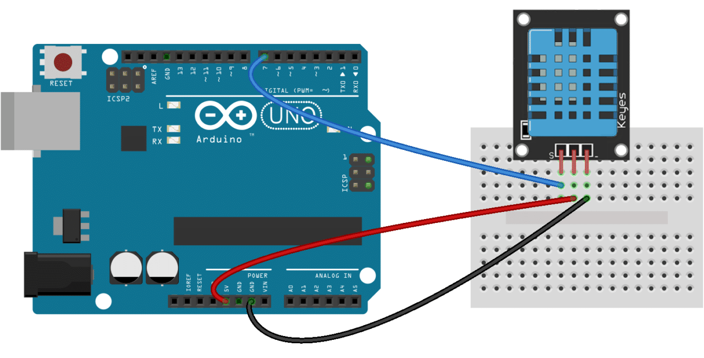
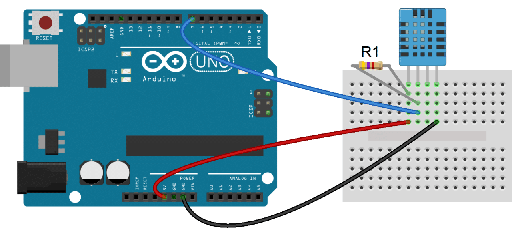

# Overview of a DHT 11 Sensor.

The DHT 11 is temperature and humidity sensor widely used in DIY projects, due to its simplicity and affordability. We will shortly breakdown this sensor to better understand before using in our Plan-Pulse project.

It consists of a **thermistor** for temperature measurement, a **capacitive humidity sensor** for relative humidity measurement and an **8-bit microcontroller** inside that processes and sends data as a digital signal.




Thermistor for Temperature measurement



Humidity Sensor



8 Bit Microcontroller

  

Here are the ranges and accuracy of the DHT11:

- Humidity Range: 20-90% *RH
- Humidity Accuracy: ±5% RH
- Temperature Range: 0-50 °C
- Temperature Accuracy: ±2% °C
- Operating Voltage: 3V to 5.5V

*RH stands for Relative Humidity, which means the amount of water vapor in air vs the saturation point of water vapor in air. at 100% we reach the saturation point, the water then starts to accumulate on surfaces and forms water drops.

The DHT 11 comes in two forms; **Module**, which comes with a built up pull up resistor and **Raw sensor**  which requires an external pull up resistor.



# How to connect and program a DHT 11 with an Arduino?

In the below figures you will find how you can wire both types of DHT11’s with an Arduino:





To start programming the DHT 11, you will first need to install the DHTLib library. It has all the functions needed to get the humidity and temperature readings from the sensor. To install it, you will need to download the below Zip file, then open your Arduino IDE, go to Sketch>Include Library>Add .ZIP Library and select the DHTLib.zip file. 

After it’s installed, upload this example program to the Arduino and open the serial monitor:

```arduino
#include <dht.h>

dht DHT;

#define DHT11_PIN 7

void setup(){
  Serial.begin(9600);
}

void loop(){
  int chk = DHT.read11(DHT11_PIN);
  Serial.print("Temperature = ");
  Serial.println(DHT.temperature);
  Serial.print("Humidity = ");
  Serial.println(DHT.humidity);
  delay(1000);
}
```

You should see the humidity and temperature readings displayed at one second intervals.

**Code Breakdown:**

1. **`#include <dht.h>`** – Includes the DHT sensor library (uses a different approach than Adafruit's library).
2. **`dht DHT;`** – Creates an object `DHT` to interact with the sensor.
3. **`#define DHT11_PIN 7`** – Defines pin **7** as the data pin for the DHT11 sensor.
4. **`Serial.begin(9600);`** – Starts serial communication at **9600 baud**.
5. **`int chk = DHT.read11(DHT11_PIN);`**
    - Reads data from the **DHT11 sensor** connected to pin **7**.
    - Stores the status in `chk` (used for error checking, though not used in this case).
6. **`Serial.print()` and `Serial.println()`** – Print **temperature** and **humidity** values to the Serial Monitor.
7. **`delay(1000);`** – Waits **1 second** before taking another reading.