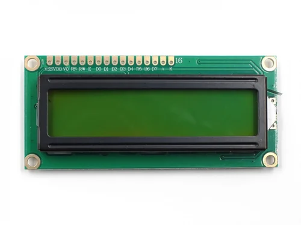
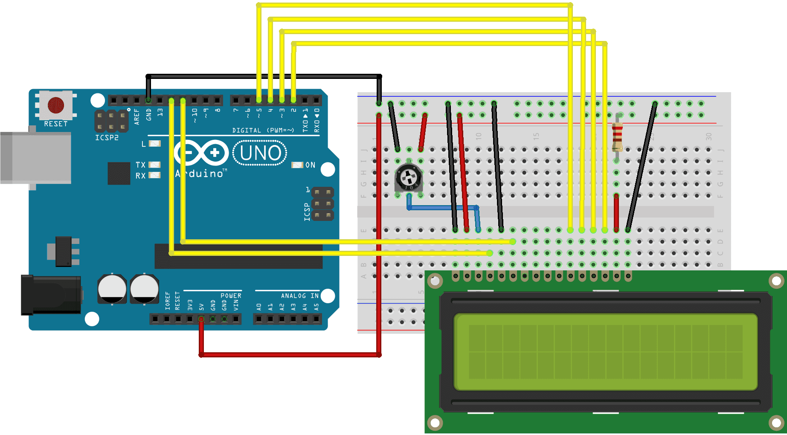

# Overview of an LCD Display.

Liquid Crystal Displays (LCDs) are widely used to display information such as text, numbers, and symbols. The most common type used in DIY electronics projects is the **16x2 LCD**, which can display **16 characters per row across 2 rows**. This makes it an ideal choice for projects requiring a simple and efficient display module.

Below is the common specs of a 16x2 LCD:

- **Characters:** 16 per row, 2 rows
- **Operating Voltage:** 5V
- **Backlight:** LED-based (optional)
- **Interface:** Parallel (4-bit or 8-bit mode)
- **Controller:** HD44780 or compatible



LCDs use a parallel interface, requiring the microcontroller to control multiple pins simultaneously to manage the display. This interface includes the following key pins:

- **Register Select (RS) pin** – Determines whether data is being written to the screen or if an instruction is being sent to the LCD’s controller.
- **Read/Write (R/W) pin** – Specifies whether the LCD is in read or write mode.
- **Enable (E) pin** – Activates the process of writing data to the registers.
- **Data pins (D0 - D7)** – Represent the bits being written or read, depending on the operation.

Additionally, the LCD features a **contrast control pin (Vo)** to adjust display clarity, **power supply pins (+5V and GND)** for operation, and **LED backlight pins (Bklt+ and Bklt-)** to manage screen illumination.

# How to connect and program an LCD with an Arduino?

In the below figure, you can see how you can wire an LCD with an Arduino



- **VCC** → **5V** (Power)
- **GND** → **GND** (Ground)
- **RS (Register Select)** → **Pin 12**
- **EN (Enable)** → **Pin 11**
- **D4-D7 (Data Pins)** → **Pins 5, 4, 3, 2**
- **Potentiometer (10KΩ)** → Adjusts contrast
- **A (Anode, +)** → **5V** (Powers the LCD backlight)
- **K (Cathode, -)** → **GND** (Completes the circuit for backlight)

To display text on an **LCD 16x2 module**, we need to use the **LiquidCrystal** library for parallel connections. These libraries allow us to send commands and display text easily.

The **LiquidCrystal** library is already included in the Arduino IDE, so we do not have to install it.

```arduino
#include <LiquidCrystal.h>

LiquidCrystal lcd(12, 11, 5, 4, 3, 2); // (RS, E, D4, D5, D6, D7)

void setup() {
  lcd.begin(16, 2); // Initialize the 16x2 LCD
  lcd.print("Hello, World!");
}

void loop() {
  // No repeated actions needed
}
```

**Code Breakdown:**

- **`#include <LiquidCrystal.h>`**  – Imports the required LCD library.
- **`LiquidCrystal lcd(...)`**  – Defines the LCD object and its connection pins.
- **`lcd.begin(16,2);`** – Initializes a **16x2** character LCD.
- **`lcd.print("Hello, World!");`** – Displays text on the screen.
- **`lcd.backlight();`** – Turns on the **LED backlight** (I2C only).
- **Loop section** – No need for repeated actions unless dynamic content is displayed.