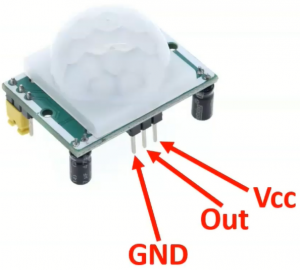
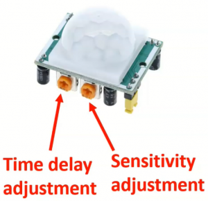
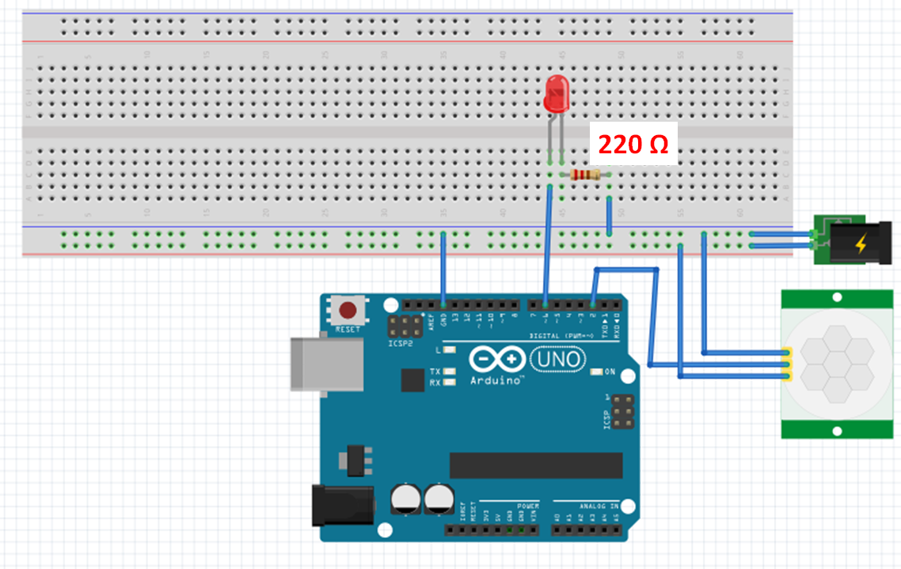

# Overview of a PIR Sensor

A **Passive Infrared (PIRT) Sensor**, is a simple motion detection sensor that is used in various applications such as security systems and automatic lighting. 

The way it works is by measuring *infrared radiation,* which is an invisible radiation that every object (Including humans and animals) gives off. 

So the PIR Sensor has two infrared-sensitive elements inside that detects the changes in the amount of infrared energy that the object is emitting. 

To simplify even further we can say that the sensor sees a steady pattern of infrared energy hitting elements when no motion is done, but once this energy suddenly changes, the sensor reacts and informs us that there is motion.

Below is the common specs of  a PIR Sensor:

- **Operating Voltage:** 3.3V – 5V
- **Detection Range:** Typically **3 – 7 meters** (adjustable)
- **Detection Angle:** **120° – 180°** (depending on model)
- **Interface:** Digital Output (HIGH when motion is detected)
- **Warm-up Time:** **10 – 60 seconds** after power-up
- **Adjustable Settings:** Sensitivity and delay time





**GND:** This pin is connected to the main circuit ground. 

**VCC:** A typical voltage for VCC for this sensor is 5V.

**Out:** This pin will output 3.3V when motion is detected, and 0V when there is no motion.

**Sensitivity:** This will define the range/distance over which the sensor will be “looking” for motion.

**Time Delay:** This is how long the sensor will provide an output of 3.3V after the motion has been detected. This will range from 3 seconds, to 5 minutes.

# How to Connect and Program a PIR Sensor with an Arduino?

Below is a simple wiring guide for connecting a PIR sensor to an **Arduino**:



In this example, the sensor is connected to the Arduino through the pin 2, and then we connected an LED and a 220 OHM resistor in series with pin 6 and then to ground, this will allow us to trigger a command in the Arduino to light up the LED when the sensor output is active.

```arduino
int PIR = 2; //GPIO 2 --- Digital Input coming from PIR (HC-SR501)
int LED = 6; //GPIO 6 --- Digital Output to LED
int PIR_State=0; //Variable to handle PIR state
 
void setup() {
  // put your setup code here, to run once:
pinMode(PIR, INPUT); //Step pin as input
pinMode(LED, OUTPUT); //Step pin as output
}
 
void loop() {
  // put your main code here, to run repeatedly:
 
PIR_State=digitalRead(PIR);
if (PIR_State == 1){
  digitalWrite(LED, HIGH);
}
else{
  digitalWrite(LED, LOW);
}
}
```

**Code Breakdown:**

- **`PIR = 2`** → The **PIR sensor** is connected to **pin 2** of the microcontroller.
- **`LED = 6`** → The **LED** is connected to **pin 6** as an output.
- **`PIR_State`** → A variable to store the PIR sensor’s **ON/OFF (HIGH/LOW) state**.
- **`pinMode(PIR, INPUT);`** → Configures the **PIR sensor pin** as an **input**.
- **`pinMode(LED, OUTPUT);`** → Configures the **LED pin** as an **output**.
- **`digitalRead(PIR);`** → Reads the **PIR sensor’s output** (HIGH or LOW).
- **If `PIR_State == 1` (HIGH):**
    - Motion is detected → **LED turns ON** (`digitalWrite(LED, HIGH);`).
- **Else (PIR_State == 0, LOW):**
    - No motion detected → **LED turns OFF** (`digitalWrite(LED, LOW);`).