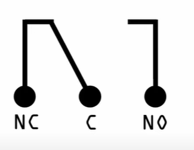
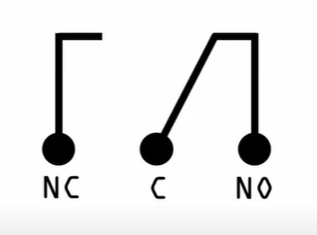
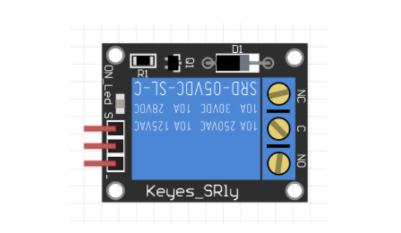
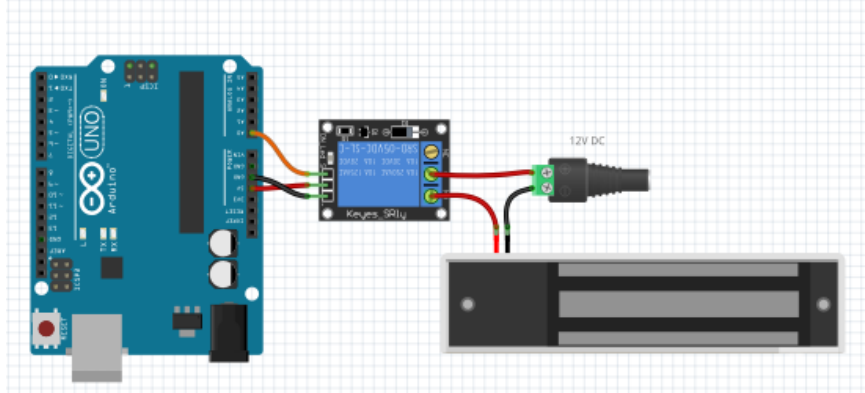

# Overview of a Relay

A Relay is an electronical component that serves as an electrical switch that is widely used in electronic projects. It has small metal contacts inside that touch together to close a circuit or break it, using electromagnetic attraction that pulls the metal contacts together. Below is a visualization of the coils inside a relay.





NC: Normally Closed

NO: Normally Open

C: Common



The main benefit of a Relay is that although it requires a very small DC current to be activated, its circuit when its connected is up to 10Amps, and either 30V DC or 240V AC, so it’s a much more powerful circuit, and certainly not one that can be driven direct from an Arduino for example.

 That is why when we are using any component that requires a significant load like a motor, the Relay which we can power with our Arduino will help us accomplish this task.

# How to Connect and Program a Relay with an Arduino?

Below is a simple wiring guide for connecting a Relay to an Arduino. 



The positive connection to the maglock is wired to the NO connection, and the
positive lead from the 12V supply is wired to the C connection. So, when the signal from the
Arduino is LOW, the power supply goes to the NC connection (which has nothing attached to it), and
the maglock is off. When the signal from the Arduino goes HIGH, the relay switches on, connecting
the C and NO connections, and the maglock turns on.

When the input signal is LOW (0v), the relay is “off” and the Common output (C) is connected to
the Normally Open (NO) output.
Sending a HIGH signal of 5v to the signal connector switches the relay “on”, which connects the
Common Output (C) to the Normally Closed (NC) output instead.

```arduino
int RELAY = 7; // GPIO 7 --- Digital Output to Relay

void setup() {
  pinMode(RELAY, OUTPUT); // Set relay pin as output
}

void loop() {
  digitalWrite(RELAY, HIGH); // Turn ON relay
  delay(5000); // Wait 5 seconds
  
  digitalWrite(RELAY, LOW); // Turn OFF relay
  delay(5000); // Wait 5 seconds
}
```

**Code Breakdown:**

- **`RELAY = 7;`** → The **relay module** is connected to **pin 7** of the **Arduino**.
- **`pinMode(RELAY, OUTPUT);`** → Configures the **relay control pin** as an **output**.
- **`digitalWrite(RELAY, HIGH);`** → Activates the relay (turns ON the connected device).
- **`delay(5000);`** → Keeps the relay ON for **5 seconds**.
- **`digitalWrite(RELAY, LOW);`** → Deactivates the relay (turns OFF the connected device).
- **`delay(5000);`** → Keeps the relay OFF for **5 seconds**.