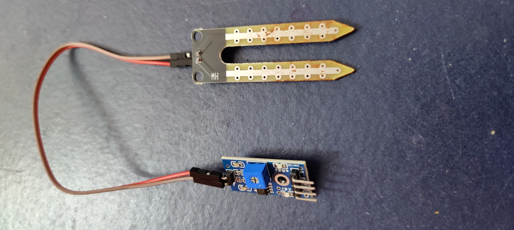
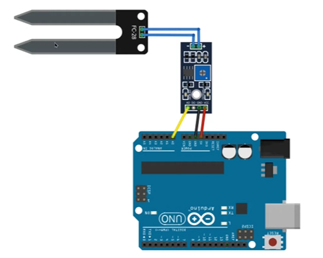

# Overview of a Soil Moisture Sensor

The Soil Moisture Sensor or the Hygrometer Sensor is an electronic component used to measure the quantity of water in the soil. It has two big Probes that are inserted in the soil, and when the soil is moist, it conducts electricity better, and when it’s dry the resistance is high and conductivity is low, so the sensor calculates this resistance and turns it into a voltage signal that the Arduino can read.

Sensor specifications.

- Input voltage: 3.3V - 5V
- Output voltage: 0V - 4.2V
- Input current: 35 mAmps



# How to Connect and Program a Soil Moisture Sensor with an Arduino?

Below is a simple wiring guide for connecting a Soil Moisture Sensor to an Arduino. 



```arduino
int sensorPin = A0; // Sensor output connected to A0
int moistureValue;

void setup() {
  Serial.begin(9600);
}

void loop() {
  moistureValue = analogRead(sensorPin); // Read sensor data
  Serial.print("Soil Moisture Level: ");
  Serial.println(moistureValue);
  delay(1000);
}
```

**Code Breakdown:**

- **`sensorPin = A0;`** → The **soil moisture sensor** is connected to **analog pin A0**.
- **`moistureValue;`** → A variable to store the **sensor reading**.
- **`Serial.begin(9600);`** → Initializes the **serial monitor** to display moisture readings.
- **`analogRead(sensorPin);`** → Reads the **sensor's analog output**, which changes based on soil moisture.
- **`Serial.print("Soil Moisture Level: ");`** → Prints a label for clarity.
- **`Serial.println(moistureValue);`** → Displays the **sensor reading** on the serial monitor.
- **`delay(1000);`** → Waits **1 second** before taking another reading to prevent flooding the serial monitor.