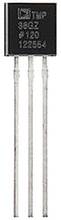
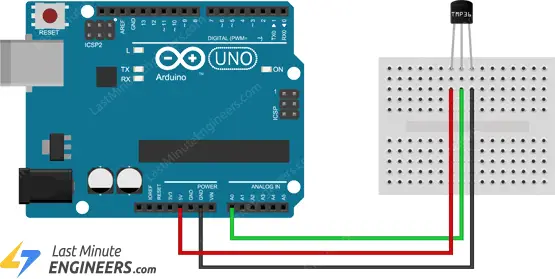

# Overview of the TMP36 Sensor

The TMP36 is a low voltage easy to use temperature sensor that is very easy to use with an Arduino. It is fairly precise, and works under many environmental conditions, it requires no external components or additional calibration. 

It provides fairly precise results with a typical accuracy of  ±1°C at +25°C and ±2°C over the −40°C to +125°C temperature range.



Below is the complete specifications of TMP36:

| **Power supply** | 2.7V to 5.5V |
| --- | --- |
| **Current draw** | 50µA |
| **Temperature range** | -40°C to 125°C |
| **Accuracy** | ±2°C |
| **Output scale factor** | 10mV/°C |
| **Output range** | 0.1V (-40°C) to 1.75V (125°C) |
| **Output at 25°C** | 750mV |

# How to connect and program a DHT 11 with an Arduino?

To connect a TMP36 with an Arduino you just need to connect three pins, two for power and one to read the sensor value.



As you can see in the wiring diagram above, the output of the TMP36 is connected to one of the analog inputs of the Arduino. The value of this analog input can be read with the `analogRead()` function.

However, the `analogRead()` function does not actually return the output voltage of the sensor. Instead it maps the input voltage between 0 and the the operating voltage i.e. 5V or 3.3V to 10-bit integer values ranging from 0 to 1023. 

To convert this value back to the sensor’s output voltage, use this formula:

```arduino
Vout = (analogRead(Pin)) * (5 / 1024) //If using 5V operating voltage
or 
Vout = (reading from ADC) * (3.3 / 1024) //If using 3.3V operating voltage
```

Then, to convert volts into temperature, you need to use this formula:

```arduino
Temperature (°C) = (Vout – 0.5) * 100
```

Below is an example code that reads temperature from TMP36 and prints the temperature on the serial monitor.

```arduino
// Define the pin that the TMP36 is connected to
#define sensorPin A0

void setup() {
  // Begin serial communication at 9600 baud rate
  Serial.begin(9600);
}

void loop() {
  // Get the voltage reading from the TMP36
  int reading = analogRead(sensorPin);

  // Convert that reading into voltage
  // Replace 5.0 with 3.3, if you are using a 3.3V Arduino
  float voltage = reading * (5.0 / 1024.0);

  // Convert the voltage into the temperature in Celsius
  float temperatureC = (voltage - 0.5) * 100;

  // Print the temperature in Celsius
  Serial.print("Temperature: ");
  Serial.print(temperatureC);
  Serial.print("\xC2\xB0"); // shows degree symbol

  delay(1000); // wait a second between readings
}
```